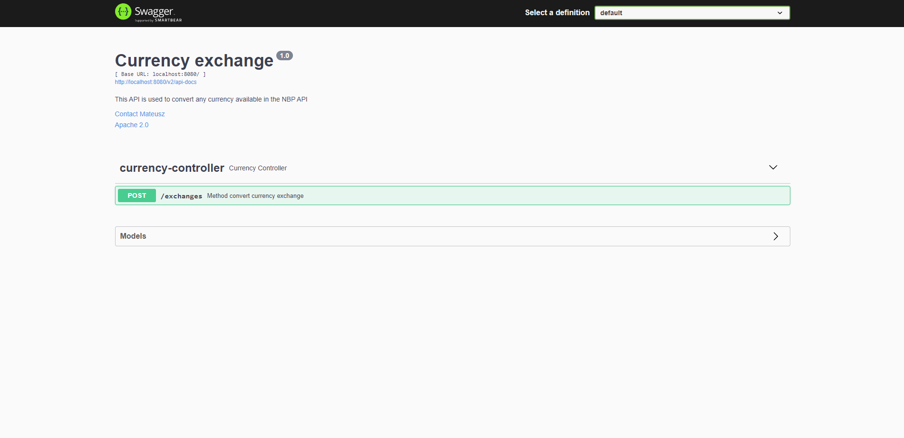
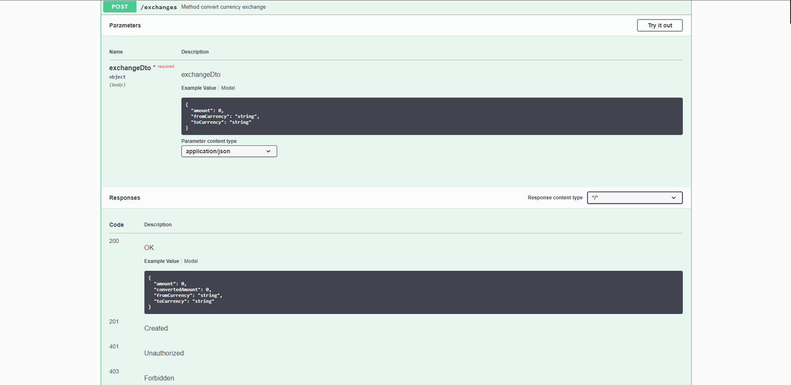
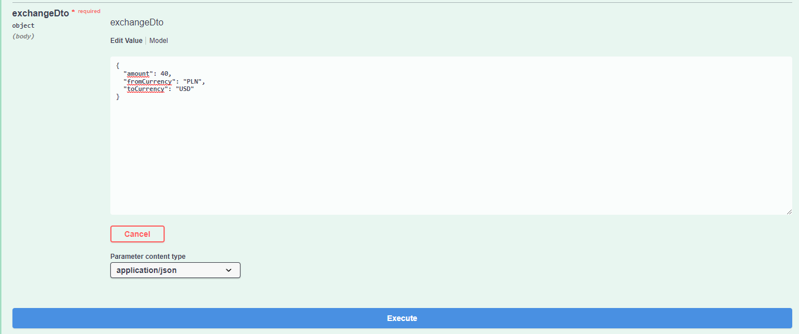
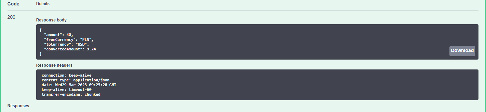

# Currency Exchange
<h3>PL</h3>
<b>Aplikacja napisana w Javie, umożliwiająca przeliczanie kwoty waluty
na dowolną inną walutę przy użyciu kursów pobranych z Narodowego Banku Polskiego za
pośrednictwem API, korzystająca z technologii Spring Boot, Hibernate i REST oraz testów
jednostkowych przy użyciu JUnit i bazy H2 podczas testów oraz PostgreSQL w
środowisku produkcyjnym.</b>

<b>Technologie:
- Java
- Spring
- Hibernate
- H2
- Postgres
- JUnit
- Mockito
- Docker
- REST
</b>

<h3>ENG</h3>
<b>A Java application allowing for currency conversion to any other currency
using rates retrieved from the National Bank of Poland API,
utilizing Spring Boot, Hibernate, and REST technologies,
as well as unit testing with JUnit and H2 database during
testing and PostgreSQL in a production environment.</b>

<b>Technology:
- Java
- Spring
- Hibernate
- H2
- Postgres
- JUnit
- Mockito
- Docker
- REST
</b>

<br></br>
<b>Swagger:</b>
```
/swagger-ui/index.html#
```
<br></br>
<b>Exchanges:</b>

|    Method    |     Url      |      Descritpion      |
|:------------:|:------------:|:---------------------:|
| <b>POST</b>  |  /exchanges  | exchange any currency |

<br></br>
<b>example request:</b>
```
{
  "amount": 20.20,
  "fromCurrency": "PLN",
  "toCurrency": "USD"
}
```
<br></br>
<b>response:</b>
```
{
  "amount": 20.2,
  "fromCurrency": "PLN",
  "toCurrency": "USD",
  "convertedAmount": 4.68
}
```

<br></br>
<b>Images:</b>








